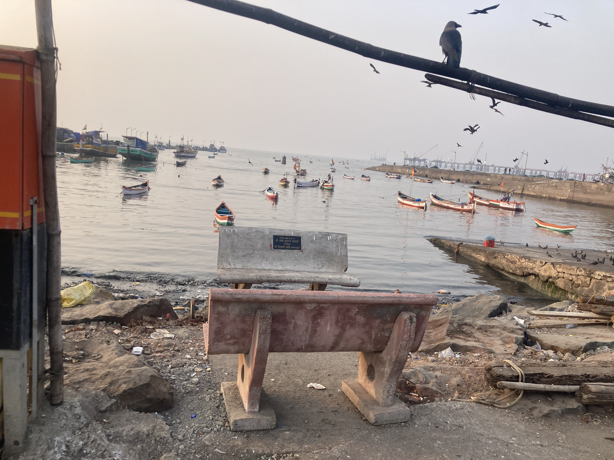
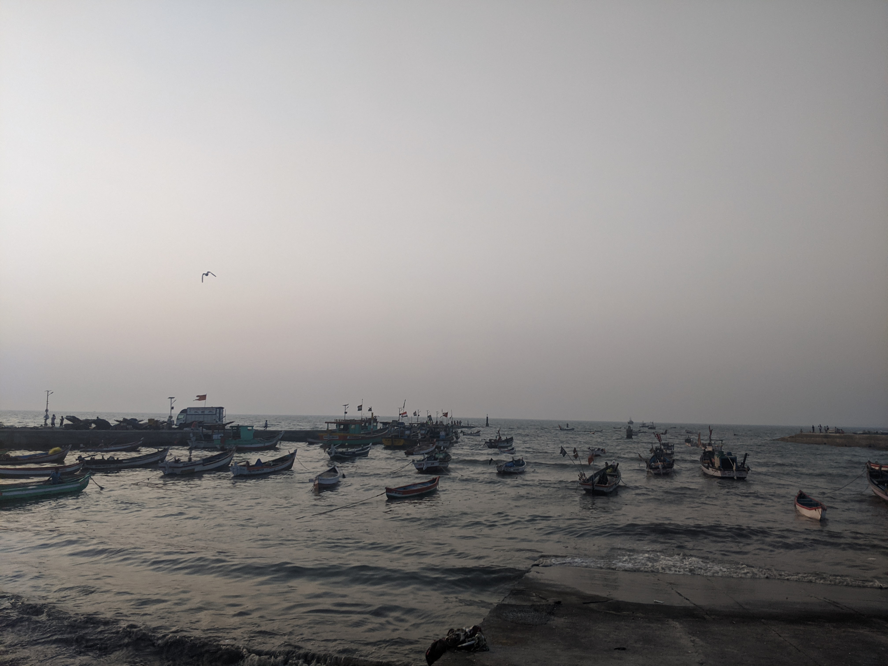
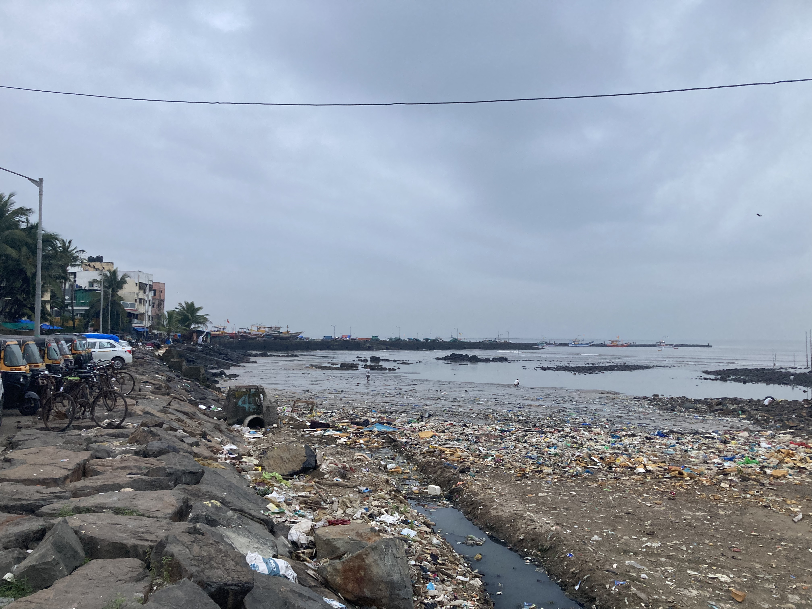
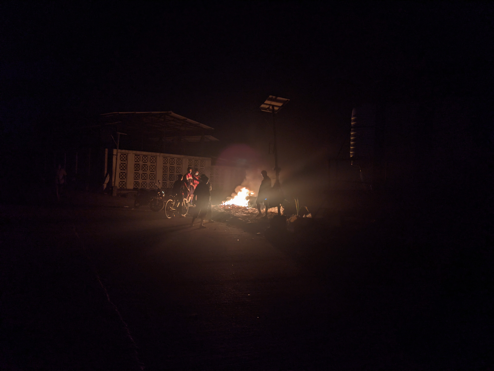
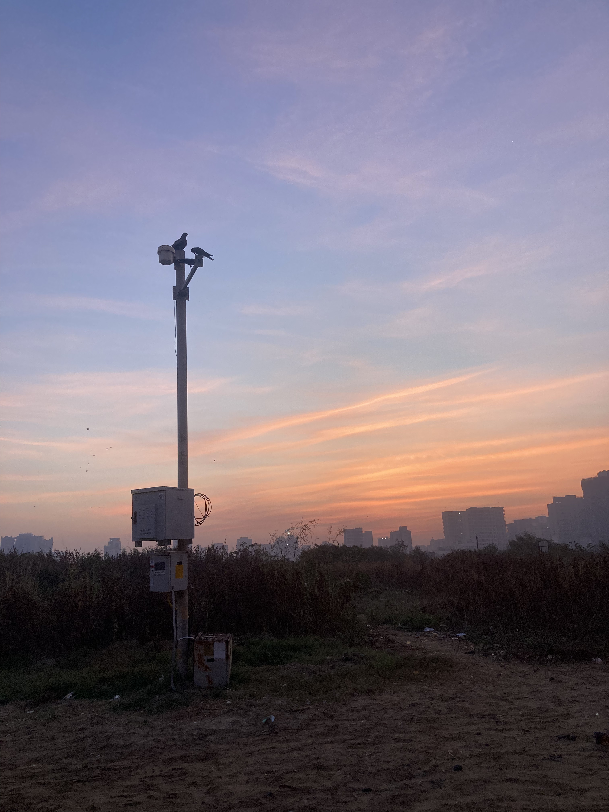
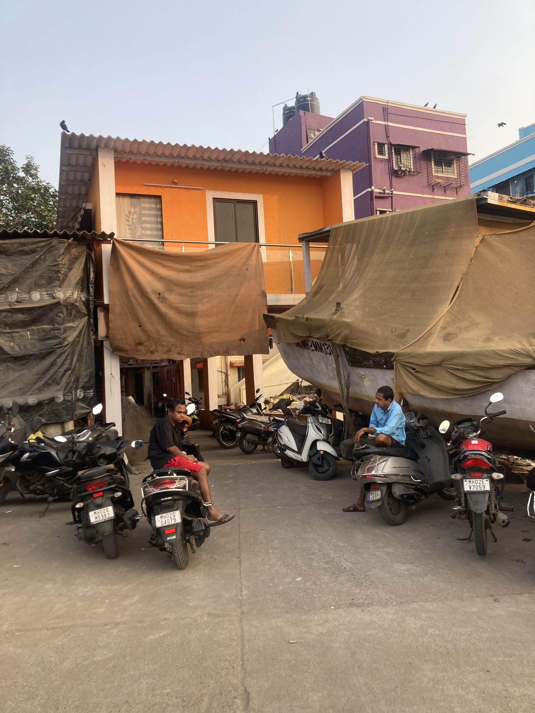
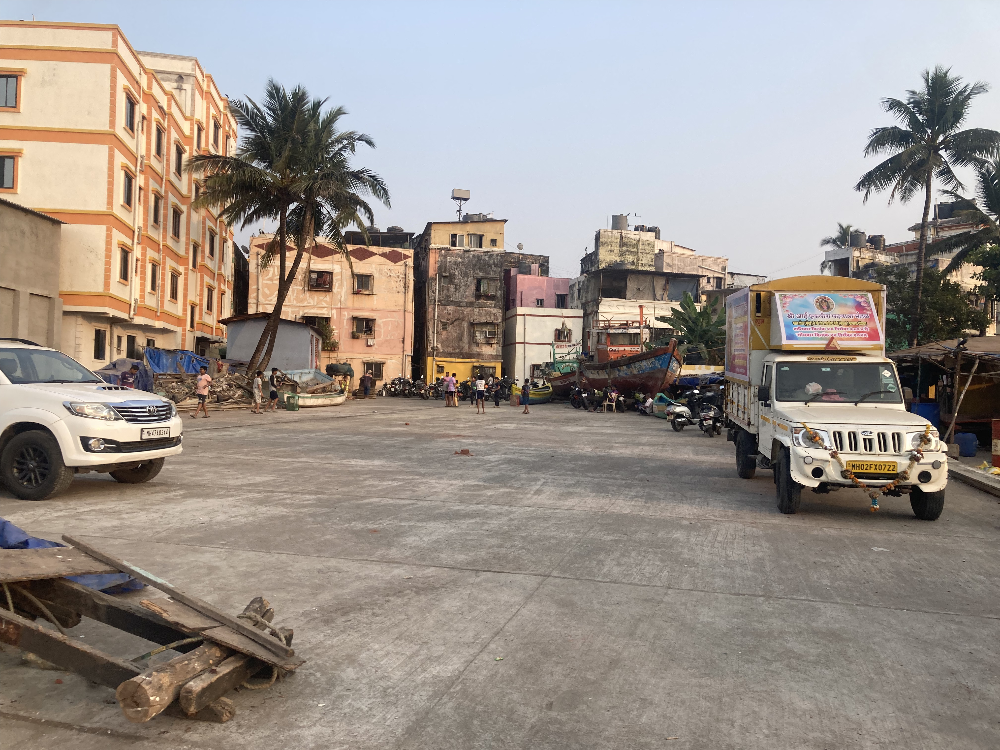

::: gallery

:::: gallery-caption
The "Danda Coastal Road" is a lovely road along between Danda Koliwada and the sea.
One end of the road is just past the end of the Carter Road Prominade,
and takes you to a pedestrian bridge crossing a nullah, bringing you to
Juhu beach near Juhu Koliwada.
::::

* 
* 

:::

::: gallery

:::: gallery-caption
One you get past the BMC's abdication of their garbage collection duty,
the Danda Coastal road is quite idyllic---multicoloured fishing boats in the harbour,
community spaces...
::::

* 
* 
:::

::: gallery

:::: gallery-caption
The star of the show, is a pedestrian bridge taking you to Juhu.
Not allowing motorized through-traffic, the traffic on the road
has a reasonable balance of resident's motorized--rickshaws, scooters, smaller loading vehicles
for shops co-existing with children riding bicyles, badminton on the street, and Diwali & wedding celebrations.
::::

:::

::: gallery
* 
* 
:::
