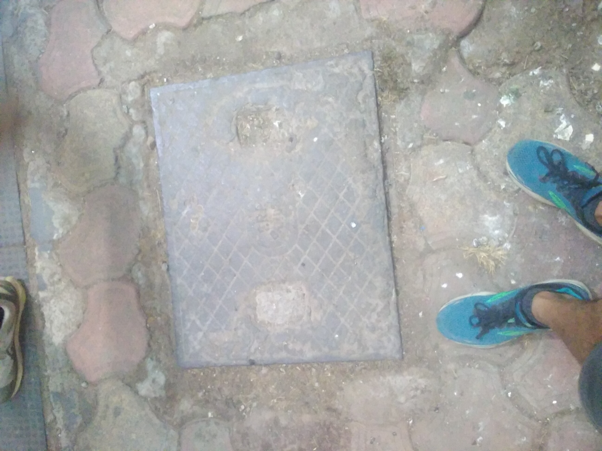
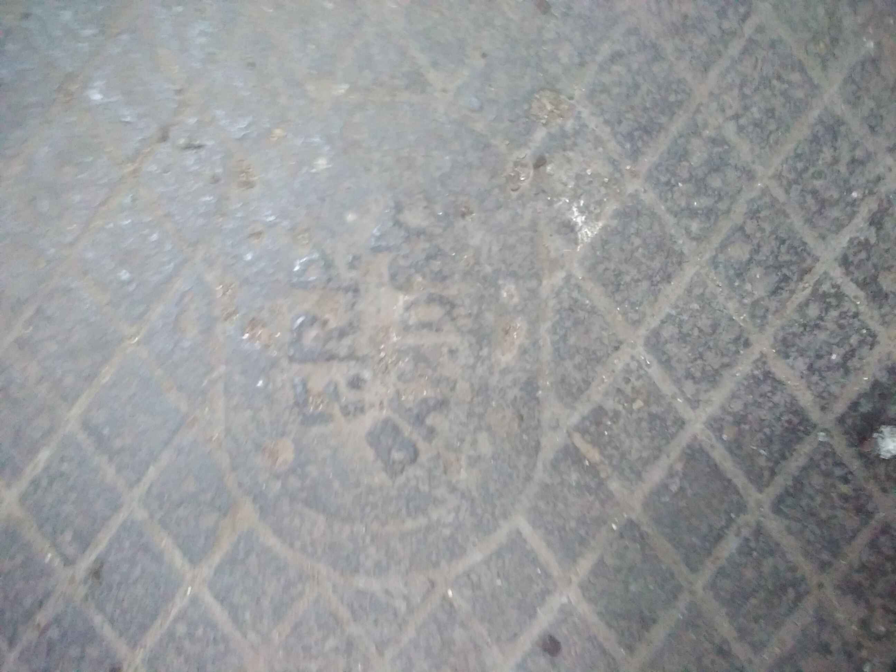
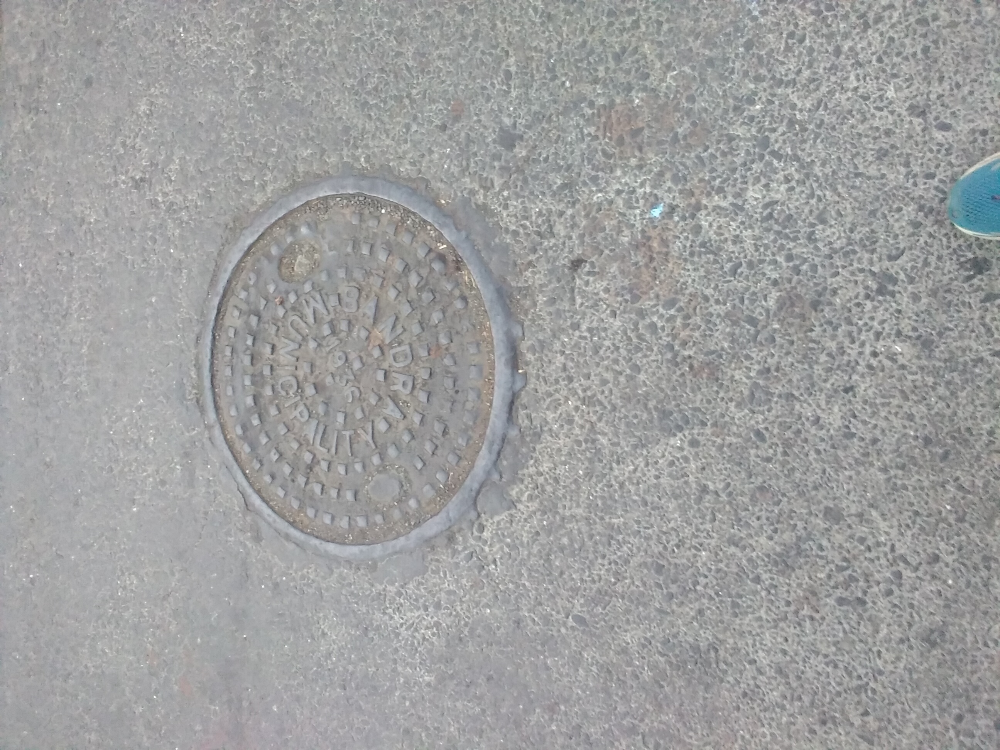
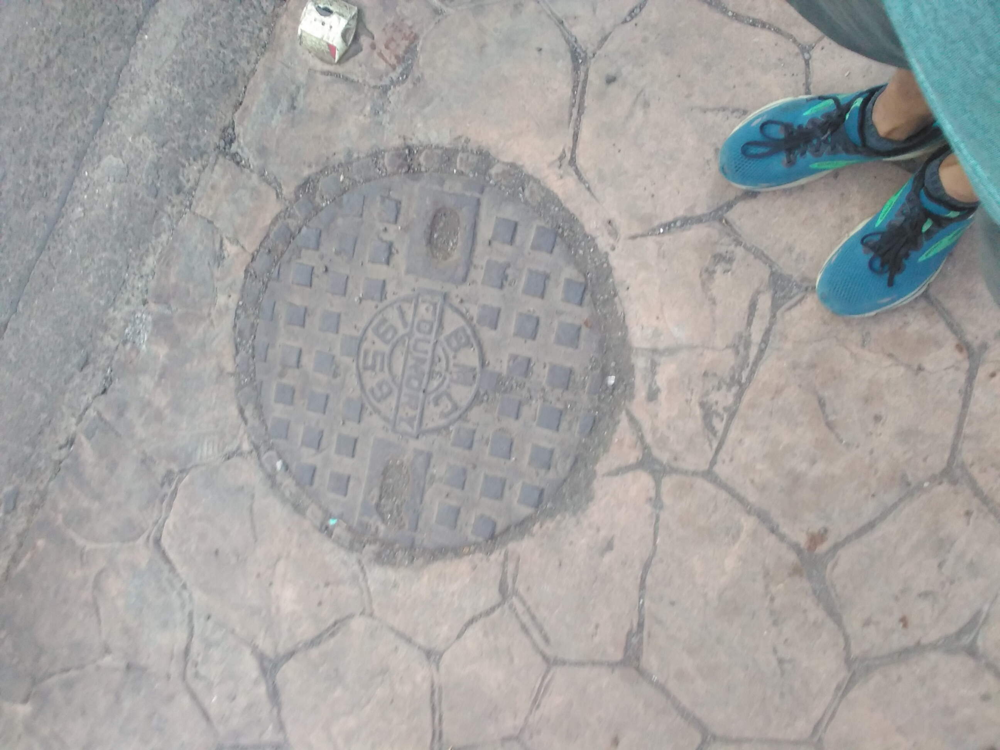
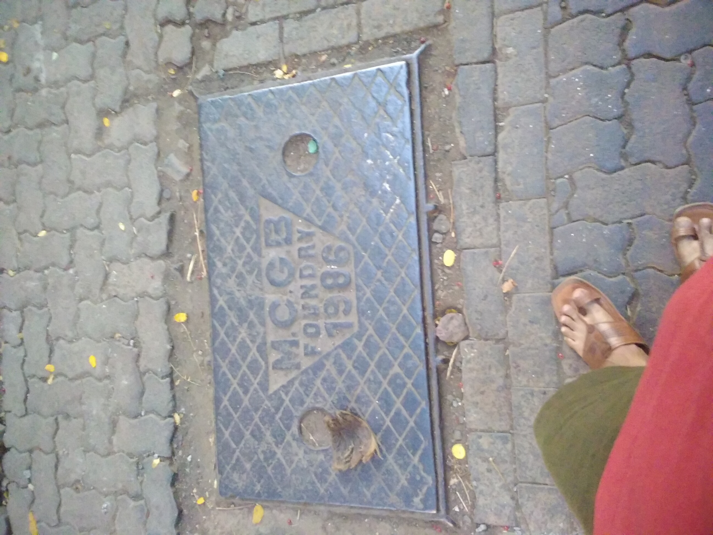
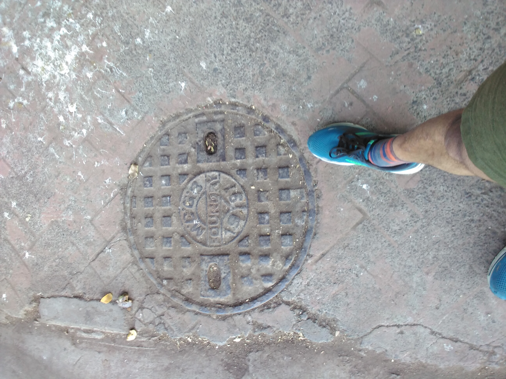
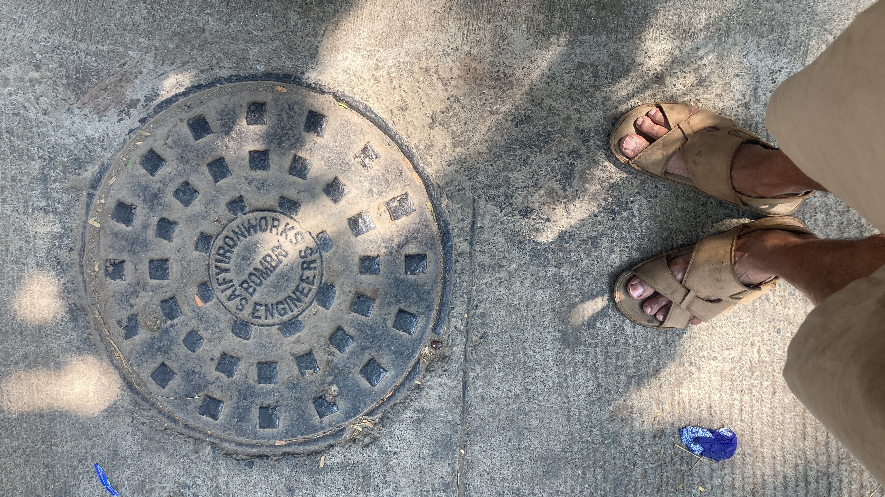
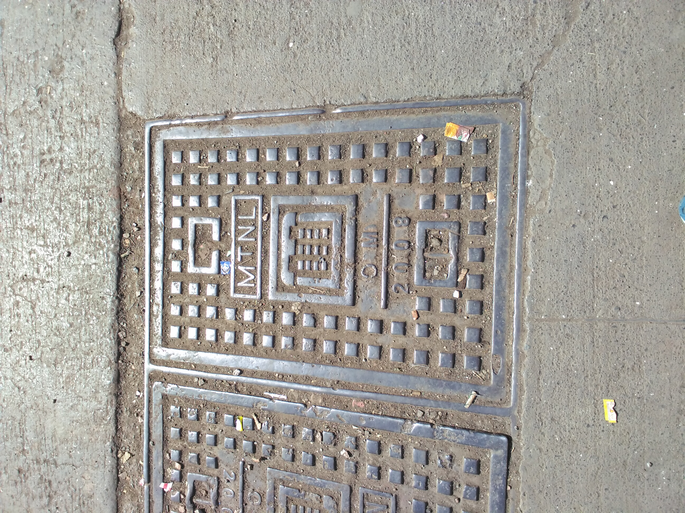
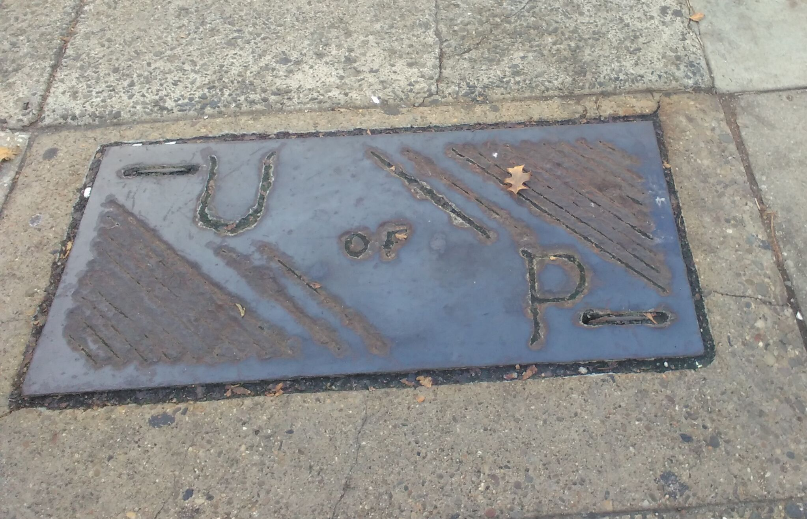

Manhole covers are a seemingly mundane piece of city infrastructure that give
grimy plumbing and sewerage a curious personality. Since municipalities don't go
around replacing them wholesale when roads are redeveloped etc,
they can reveal bits of history in charming ways.

::: gallery
:::: gallery-caption
For example, you can step through Bandra's relation to its municipality through
manhole covers. In the gullies of older villages, you see older anonymous covers
dating to 1932. Then you see along the earlier but larger streets, the Bandra
Municipality branded covers. As the sewer network widened, we see covers from
the BMC, MCGB and finally MCGM. At some point, the covers transition to concrete
and then some kind of thermoplastic composite material.
::::

* 
* 
* 
* 
* 
* 
* 

:::

::: gallery
:::: gallery-caption
Some welder had fun with this one, in Philadelphia:
::::

:::

::: gallery
:::: gallery-caption
They also make great for great postcards: I made prints of drain hardware
in Shanghai, and sent them off.
::::

[Shanghai!](./9999-shanghai.jpg)

:::
